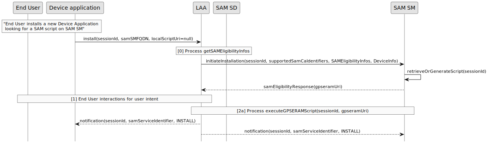
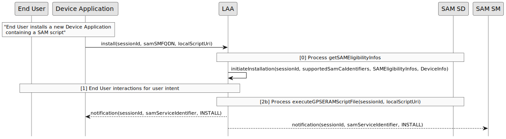
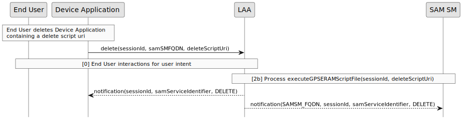
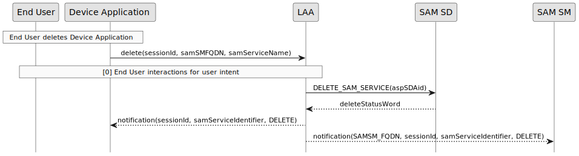

LAA <-> SAM SM- Protocol Overview
============================

This documentation defines a protocol that allows a [LAA](LAA__Terminology_And_Definitions.md#LAA) to request the management of a [SAM SD](LAA__Terminology_And_Definitions.md#SAMSD) by a [SAM SM](LAA__Terminology_And_Definitions.md#SAMSM).

The following figure presents the SAM architecture and its environment. All words in blue are defined in this documentation.

This documentation is focusing on the SAM04 interface. [GPSERAM](LAA__References.md#GPSERAM) is also used on this SAM04 interface.
[SAM Configuration](LAA__References.md#SAMCONF) is focusing more on the [SAM SD](LAA__Terminology_And_Definitions.md#SAMSD) part.
A [SAM SM](LAA__Terminology_And_Definitions.md#SAMSM) and a [LAA](LAA__Terminology_And_Definitions.md#LAA) manage this protocol to allow the [LAA](LAA__Terminology_And_Definitions.md#LAA) to trigger a [Device Application](LAA__Terminology_And_Definitions.md#DeviceApplication) and the [Secure Element](LAA__Terminology_And_Definitions.md#SecureElement).

Protocol design
---------------

### Protocol Layers

LAA protocol is a message-oriented protocol which used the following protocol stack:

[Messages](LAA__Terminology_And_Definitions.md#Message) are the data exchanged between the [SAM SM](LAA__Terminology_And_Definitions.md#SAMSM) and the [Local Applet Assistant](LAA__Terminology_And_Definitions.md#LAA). The definition, the meaning and sequency of [Messages](LAA__Terminology_And_Definitions.md#Message) are states below in the [Messages section](#messages).

How [Messages](LAA__Terminology_And_Definitions.md#Message) are carried on the network relies on the [Protocol Binding](LAA__Terminology_And_Definitions.md#ProtocolBinding) used by the [SAM SM](LAA__Terminology_And_Definitions.md#SAMSM) and the [Local Applet Assistant](LAA__Terminology_And_Definitions.md#LAA). A [Protocol Binding](LAA__Terminology_And_Definitions.md#ProtocolBinding) defines the rules to map [Messages](LAA__Terminology_And_Definitions.md#Message) on the [Data Format](LAA__Terminology_And_Definitions.md#DataFormat) layer and the [Transport](LAA__Terminology_And_Definitions.md#Transport) layer.

This version of the specification defines the following [Data Format](LAA__Terminology_And_Definitions.md#DataFormat) and [Transport](LAA__Terminology_And_Definitions.md#Transport) protocol layers:

-   **HTTPS** as [Transport](LAA__Terminology_And_Definitions.md#Transport)

-   **JSON** as [Data Format](LAA__Terminology_And_Definitions.md#DataFormat)

This version of the specification defined the following [Protocol Binding](LAA__Terminology_And_Definitions.md#ProtocolBinding):

-   **HTTP REST**, which uses HTTPS as [Transport](LAA__Terminology_And_Definitions.md#Transport) protocol and JSON as [Data Format](LAA__Terminology_And_Definitions.md#DataFormat).

### Management Session

A [LAA](LAA__Terminology_And_Definitions.md#LAA) and a [SAM SM](LAA__Terminology_And_Definitions.md#SAMSM) relies on a session identifier, named [sessionId](LAA__Terminology_And_Definitions.md#sessionId). The [sessionId](LAA__Terminology_And_Definitions.md#sessionId) is shared and used for all communications between the [LAA](LAA__Terminology_And_Definitions.md#LAA) and the [SAM SM](LAA__Terminology_And_Definitions.md#SAMSM).

The session during which is performed some management tasks that are associated with one  [sessionId](LAA__Terminology_And_Definitions.md#sessionId) is called the [Management Session](LAA__Terminology_And_Definitions.md#ManagementSession).

The [Management Session](LAA__Terminology_And_Definitions.md#ManagementSession) is started by the [LAA](LAA__Terminology_And_Definitions.md#DeviceApplication) and is then controlled until its end by the [SAM SM](LAA__Terminology_And_Definitions.md#SAMSM).
Same [sessionId](LAA__Terminology_And_Definitions.md#sessionId) SHALL be used for the [GPSERAM](LAA__References.md#GPSERAM)  session.

Protocol details
----------------------
In the following sequence diagrams, the process [1a] *executeGPSERAMScript* is defined in [GPSERAM](LAA__References.md#GPSERAM) (Protocol Overview Diagram).  The process [1b] *executeGPSERAMScriptFile* use the same data elements but is processed locally using a file. In both cases, The [LAA](LAA__Terminology_And_Definitions.md#LAA)  is able to process a script containing APDUs.
See also "[End User](LAA__Terminology_And_Definitions.md#EU) interactions for user intent" section for process [0]

### Installation

#### Online installation

The GET DATA command is defined in [SAM Configuration](LAA__References.md#SAMCONF)  section 8.4

In this mode, the Device Application sends a null parameter as *localScriptUri*, and the *install* response contains the *gpseramUri* (for instance [https://sam-sm.server1.com/gp/seram/script1](https://sam-sm.server1.com/gp/seram/script1)).

Optionally at the end of this process, the [SAM SM](LAA__Terminology_And_Definitions.md#SAMSM) MAY execute a GET STATUS command for a given ASP SD AID.

#### Local script
When a local (file) script is provided by the Device Application, it can be consumed by the LAA through a uri.

It means that *localScriptUri* parameter can be provided by the Device Application for local execution (for instance [file://data/local/euicc/sam/script1](file://data/local/euicc/sam/script1)).

In this mode, *install* is not sent to the [SAM SM](LAA__Terminology_And_Definitions.md#SAMSM) and [LAA](LAA__Terminology_And_Definitions.md#LAA)  performs a local eligibility check and installation. The Device Application relies only on the [LAA](LAA__Terminology_And_Definitions.md#LAA)  checks. [LAA](LAA__Terminology_And_Definitions.md#LAA)  checks are out of scope of this specification. *samSMFQDN* parameter is only used for the notification.

The notification SHALL contain *samServiceScriptResp* parameter in this mode because the response is not provided through [GPSERAM](LAA__References.md#GPSERAM) script.

#### SAM script commands

Typically a SAM script contains at least the following APDU commands:
-	INSTALL [for install] in order to create the ASP SD
-	INSTALL [for personalization] + STORE DATA(s) in order to personalize this ASP SD. The result shall be used by the SAM SM in order to retrieve the personalized ASP SD keys.
-	INSTALL [for load] + LOAD(s) in order to load SAM Applet(s)
-	INSTALL [for install and make selectable] in order to make the SAM Applet(s) selectable

A SAM script should also contain the following commands:
-	INSTALL [for install] in order to install the ARA-C
-	INSTALL [for personalization] + STORE DATA(s) in order to add a new access rule on the ARA-C.

### Personalization

This section describes how an SAM applet MAY be personalized by [SAM SM](LAA__Terminology_And_Definitions.md#SAMSM). Notice that a SAM applet may be personalized through other means that are out of the scope of this specification.

The same [sessionId](LAA__Terminology_And_Definitions.md#sessionId) SHOULD be used for the installation step and the personalization step.

### Deletion

#### Trigerred by LAA

A [sessionId](LAA__Terminology_And_Definitions.md#sessionId) is generated by the LAA in this scenario. The DELETE_SAM_SERVICE command is defined in [SAM Configuration](LAA__References.md#SAMCONF)  section 8.14

#### Trigerred by device application removal

The [sessionId](LAA__Terminology_And_Definitions.md#sessionId) is generated by the Device Application itself in this scenario.

##### Trigerred by device application removal using a script

The [LAA](LAA__Terminology_And_Definitions.md#LAA)  SHALL also be able to process a delete script. This script is retrieved from a uri. The *deleteScriptUri* can be a file uri or a [SAM SM](LAA__Terminology_And_Definitions.md#SAMSM) uri. Optionally at the end of this process, the [SAM SM](LAA__Terminology_And_Definitions.md#SAMSM) MAY issue a GET STATUS command to the [SAM SD](LAA__Terminology_And_Definitions.md#SAMSD) (if SCP11a is supported) to check that the ASP SD has been deleted.

##### Trigerred by device application removal using DELETE SAM SERVICE

If  the device application doesn't provide a *deleteScriptUri*, The [LAA](LAA__Terminology_And_Definitions.md#LAA)  SHALL used the DELETE_SAM_SERVICE command to process a delete request. 
The DELETE_SAM_SERVICE command is defined in [SAM Configuration](LAA__References.md#SAMCONF)  section 8.14

### Memory reset

This process allows an [End User](LAA__Terminology_And_Definitions.md#EU) to request the SAM SD memory reset. A strong confirmation SHOULD be required as defined in [SAMREQ](LAA__References.md#SAMREQ)
Notifications (to SAM SMs and to device applications) are send for each SAM services that are retrieved before the memory reset.

### List SAM services

This process allows an [End User](LAA__Terminology_And_Definitions.md#EU) to request the list of all SAM Services. No user intent is required for this operation.

Optionnaly when an [End User](LAA__Terminology_And_Definitions.md#EU) want to display information about a specific SAM Service, the LAA MAY retrieve extra information in the CRS application (see [SAM Configuration](LAA__References.md#SAMCONF) section 4.3)
ASP RID in a GET STATUS command MAY be used to filter SAM Service.

### End user interactions for user intent

[End User](LAA__Terminology_And_Definitions.md#EU) intent is acquired as defined in [SAMREQ](LAA__References.md#SAMREQ). This intent is acquired in advance or in real time. This process depends of the device and is implementation specific.

Messages
========

The following type of [Messages](LAA__Terminology_And_Definitions.md#Message) are exchanged between [Local Applet Assistant](LAA__Terminology_And_Definitions.md#LAA) and [SAM SM](LAA__Terminology_And_Definitions.md#SAMSM):

| Protocol Step    | Messages               | From         | To           |
|------------------|------------------------|--------------|--------------|
| /install        | **samInstallMsg**  | Local Applet Assistant  | SAM SM |
| /install        | **samManagementRespMsg** | SAM SM | Local Applet Assistant  |
| /delete        | **samDeleteMsg**  | Local Applet Assistant  | SAM SM |
| /delete        | **samManagementRespMsg** | SAM SM | Local Applet Assistant  |
| /notification | **notificationMsg**              | SAM SM | Local Applet Assistant  |

To be noticed that the /perso endpoint is out of scope of this specification. It is not necessarly implemented by the  [SAM SM](LAA__Terminology_And_Definitions.md#SAMSM).

Errors
========

An object statusCodeData has been defined for the error management (like [SGP22](LAA__References.md#SGP22))
see [OpenAPI specification](spec/gpseram.yaml) ([Viewer](https://gaelrgerard.github.io/laa/)) for the details

Subject Code value are defined in this table below :
| **Subject Code**      | **Description**        | 
|-------------------|------------------------| 
| 1       | Generic   (as defined in [SGP22](LAA__References.md#SGP22))     | 
| 1.1        | Function Requester (as defined in [SGP22](LAA__References.md#SGP22))      |
| 1.2 | Function Provider (as defined in [SGP22](LAA__References.md#SGP22))|
| 2 | SAM SD |
| 2.1 | SAM SD Issuer certificate |
| 2.2 | SAM SD certificate |
| 3 | SAM SM |
| 3.1 | SAM SM certificate |
| 8 | SAM CA |

Reason Code value are defined in this table below :

| **Reason Code**      | **Description**        | 
|-------------------|------------------------| 
|1| Access Error (as defined in [SGP22](LAA__References.md#SGP22))|
|1.1| Unknown (Identification or Authentication) (as defined in [SGP22](LAA__References.md#SGP22))|
|1.2| Not Allowed (Authorisation) (as defined in [SGP22](LAA__References.md#SGP22))|
|2| Format Error (as defined in [SGP22](LAA__References.md#SGP22))|
|2.1| Invalid (as defined in [SGP22](LAA__References.md#SGP22))|
|2.2| Mandatory Element Missing (as defined in [SGP22](LAA__References.md#SGP22))|
|2.3| Conditional Element Missing (as defined in [SGP22](LAA__References.md#SGP22))|
|3| Conditions of Use Not Satisfied (as defined in [SGP22](LAA__References.md#SGP22))|
|3.1| Unsupported (as defined in [SGP22](LAA__References.md#SGP22))|
|3.3| Already in Use (Uniqueness) (as defined in [SGP22](LAA__References.md#SGP22))|
|3.7| Unavailable (as defined in [SGP22](LAA__References.md#SGP22))|
|3.8| Refused (as defined in [SGP22](LAA__References.md#SGP22))|
|3.9| Unknown (as defined in [SGP22](LAA__References.md#SGP22))|
|3.10| Invalid Association (as defined in [SGP22](LAA__References.md#SGP22))|
|3.11| Value has Changed (as defined in [SGP22](LAA__References.md#SGP22))|
|3.12| Invalid Match (as defined in [SGP22](LAA__References.md#SGP22))|
|4| Processing Error (as defined in [SGP22](LAA__References.md#SGP22))|
|4.2| Execution Error (as defined in [SGP22](LAA__References.md#SGP22))|
|4.3| Stopped on Warning (as defined in [SGP22](LAA__References.md#SGP22))|
|4.8| Insufficient Memory (as defined in [SGP22](LAA__References.md#SGP22))|
|4.10| Time to Live Expired (as defined in [SGP22](LAA__References.md#SGP22))|
|5| Transport Error (as defined in [SGP22](LAA__References.md#SGP22))|
|5.1| Inaccessible (as defined in [SGP22](LAA__References.md#SGP22))|
|6| Security Error (as defined in [SGP22](LAA__References.md#SGP22))|
|6.1| Verification Failed (as defined in [SGP22](LAA__References.md#SGP22))|
|6.3| Expired (as defined in [SGP22](LAA__References.md#SGP22))|
|6.4| Maximum number of attempts exceeded (as defined in [SGP22](LAA__References.md#SGP22))|

